# 毕业设计精选-基于springboot的大学生心理健康管理系统

#### 系统概要

本大学生心理健康管理系统是基于Spring Boot框架开发的一套综合性服务平台，旨在通过数字化手段提升大学生心理健康教育的效率与质量，促进校园心理健康环境的建设。系统集成了管理端、心理老师端和学生端三大角色，每个角色均设计有针对其职责和需求的功能模块，实现了心理健康知识的普及、学生心理状态的监测、以及心理健康教育的个性化服务。该系统不仅简化了传统心理健康教育的工作流程，还通过数据分析为管理决策提供了有力支持。

#### 研究背景

信息数据从传统到当代，是一直在变革当中，突如其来的互联网让传统的信息管理看到了革命性的曙光，因为传统信息管理从时效性，还是安全性，还是可操作性等各个方面来讲，遇到了互联网时代才发现能补上自古以来的短板，有效的提升管理的效率和业务水平。传统的管理模式，时间越久管理的内容越多，也需要更多的人来对数据进行整理，并且数据的汇总查询方面效率也是极其的低下，并且数据安全方面永远不会保证安全性能。结合数据内容管理的种种缺点，在互联网时代都可以得到有效的补充。结合先进的互联网技术，开发符合需求的软件，让数据内容管理不管是从录入的及时性，查看的及时性还是汇总分析的及时性，都能让正确率达到最高，管理更加的科学和便捷。本次开发的大学生心理健康管理系统实现了字典管理、试卷表管理、试题表管理、考试记录表管理、答题详情表管理、错题表管理、健康知识管理、通知管理、心理老师收藏管理、心理老师留言管理、心理老师预约订单管理、学生管理、心理老师管理、管理员管理等功能。系统用到了关系型数据库中王者MySql作为系统的数据库，有效的对数据进行安全的存储，有效的备份，对数据可靠性方面得到了保证。并且程序也具备程序需求的所有功能，使得操作性还是安全性都大大提高，让大学生心理健康管理系统更能从理念走到现实，确确实实的让人们提升信息处理效率。

#### 技术栈

后端技术栈：Springboot+Mysql+Maven

前端技术栈：Vue+Html+Css+Javascript+ElementUI

开发工具：Idea+Vscode+Navicate

#### 系统功能介绍

管理端  
个人中心：提供管理员个人信息的查看与编辑功能，保障账户安全。  
基础数据管理：维护系统的基础数据，如学校信息、院系设置等，为后续功能提供数据支持。  
健康知识管理：发布、编辑、删除心理健康知识文章，供师生查阅学习。  
通知管理：发布重要通知，如心理讲座、活动预告等，确保信息及时传达。  
学生管理：查看学生基本信息，管理学生心理健康档案，监测学生心理健康状态。  
心理老师管理：管理心理老师的资料与权限，确保团队有序运作。  
试卷管理：设计、发布心理健康测试问卷，评估学生心理健康状况。  
考试管理：组织在线考试，自动评分，提供分析报告。  
轮播图信息管理：设置系统首页轮播图，展示心理健康宣传内容。  

心理老师端  
心理老师端在继承管理端部分功能的基础上，更加强调教学与服务功能：  
 
试卷表：设计并管理适用于不同场景的心理健康测试问卷。  
健康知识：查阅并推荐给学生合适的心理健康知识文章。  
通知：接收并转发管理端下发的通知，与学生保持沟通。  
心理老师：查看同行信息，促进学术交流与合作。  
个人中心：管理个人信息与偏好设置。  
后台管理：在授权范围内，进行健康知识、通知、学生、心理老师、试卷及考试的管理。 
 
学生端  
学生端注重用户体验与互动性：  

试卷表：参与心理健康测试，了解自己的心理状态。  
健康知识：浏览学习心理健康知识，提升自我认知与调节能力。  
通知：接收系统通知，了解心理健康活动安排。  
心理老师：查看心理老师信息，预约咨询或提问。  
个人中心：管理个人信息，查看心理健康档案与测试报告。  
后台管理（受限）：在特定权限下，参与健康知识管理、通知查看及考试管理等，增强参与感与责任感。  

#### 系统模块设计

大学生心理健康管理系统系统在进行系统中功能模块的划分时，采用层次图来进行表示。层次图具有树形结构，它能使用矩形框来描绘数据信息。顶层代表的数据结构很完整，顶层下面的矩形框表示的数据就是子集数据，当然处于最下面的矩形框就是不能再进行细分的数据元素了，使用层次方框图描述系统功能能让用户一目了然，能够明白系统的功能，以及对应功能板块下面的子功能都可以清楚领会。大学生心理健康管理系统分为管理员和用户两部分操作角色，下面将对他们的功能进行阐述。
管理员可以管理用户的基本信息，可以管理等功能。管理员功能结构图如下：

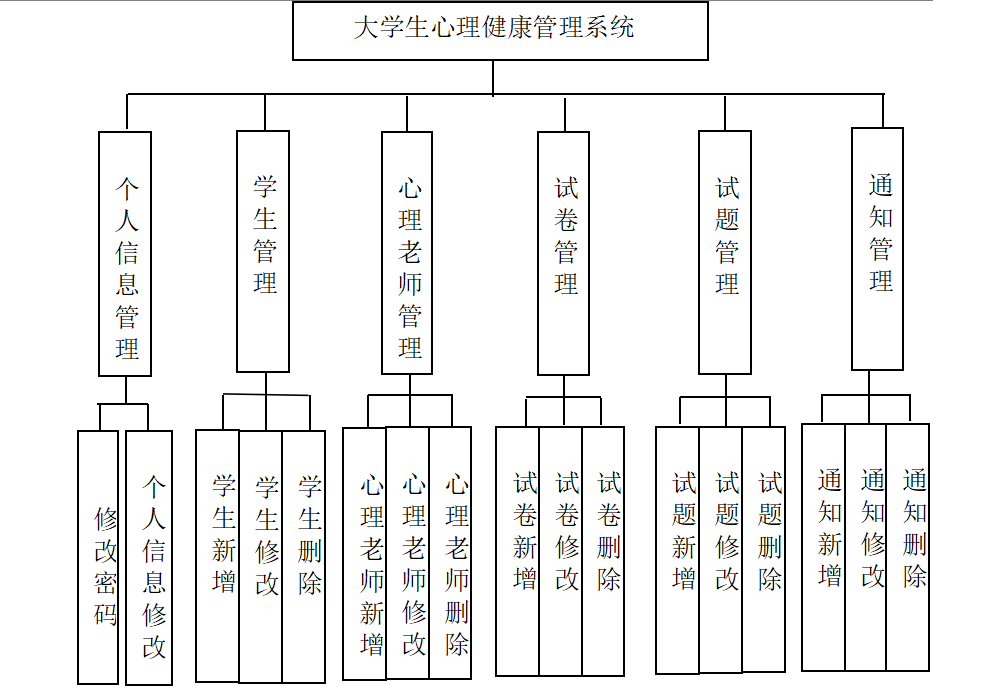

#### 系统流程分析

大学生心理健康管理系统的开发也是有对应的流程，开发之前必须要进行用户功能需求的分析，最后根据功能需求进行网站设计还有数据库相关数据的设计工作，此次开发的大学生心理健康管理系统开发流程如下：

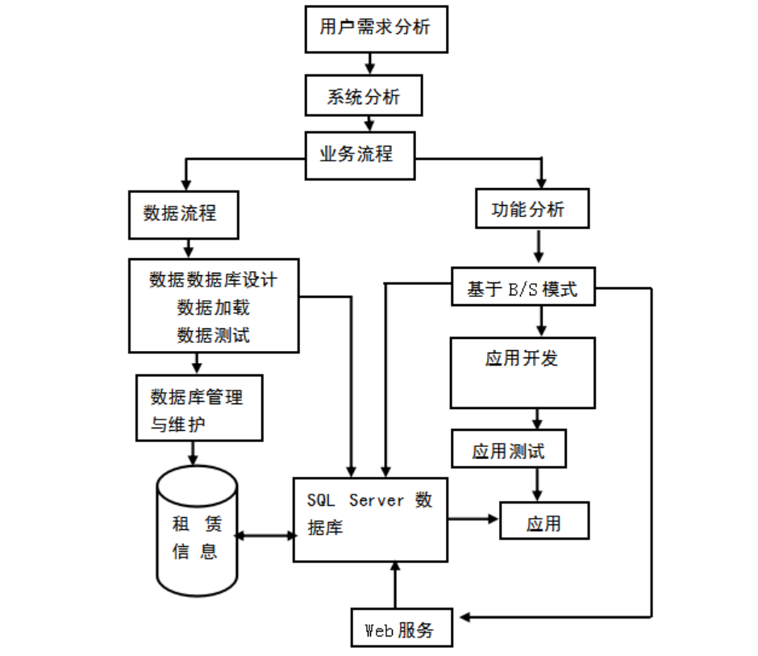

系统开发完成之后会给用户提供登录入口，在这个界面用户输入的信息会得到验证，通过验证之后才能进去大学生心理健康管理系统的访问主界面，系统登录执行流程如下：

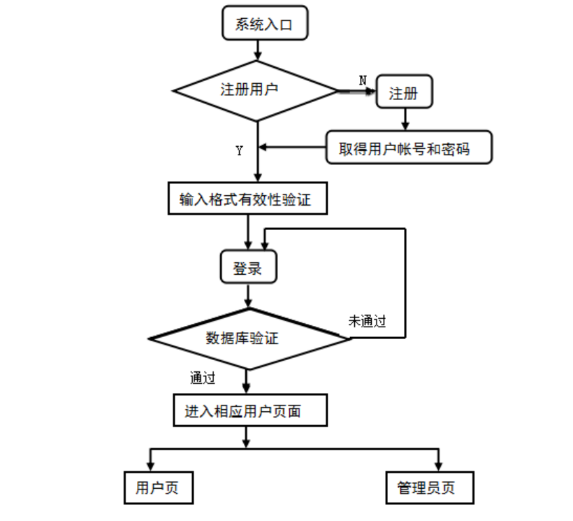

#### 系统作用

本系统通过数字化手段，实现了大学生心理健康教育的全面升级。一方面，它拓宽了心理健康知识的传播渠道，提高了知识普及的广度和深度；另一方面，通过心理健康测试与档案管理，实现了对学生心理状态的动态监测与个性化干预，为心理问题的早期发现与解决提供了有力支持。同时，系统还促进了心理老师与学生之间的有效沟通，增强了心理健康教育的互动性和实效性。

#### 系统功能截图

登录

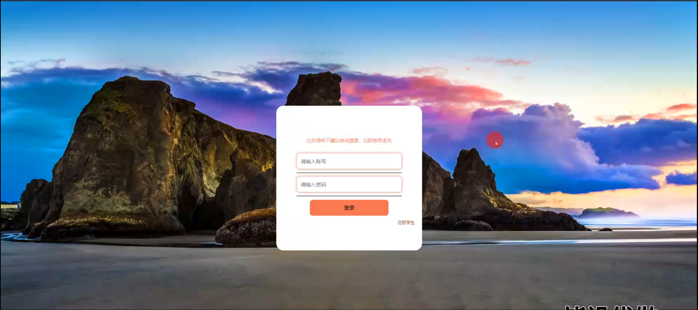

试卷表模块

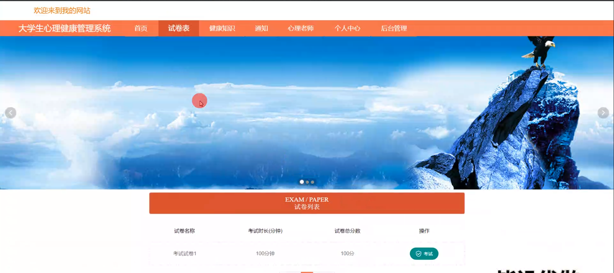

健康知识模块

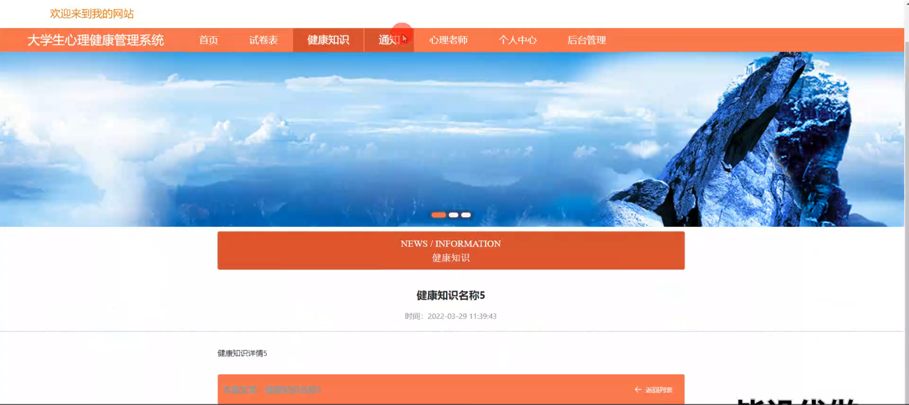

通知模块

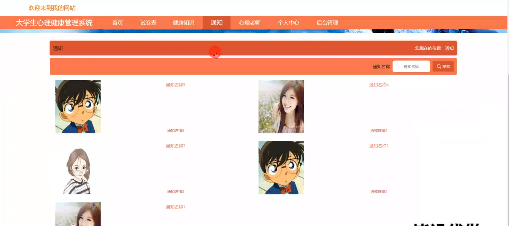

心理老师模块

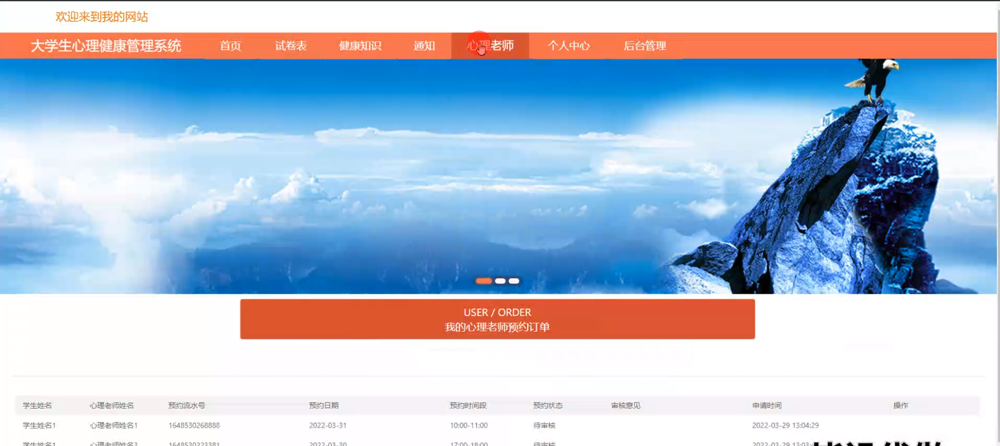

个人中心

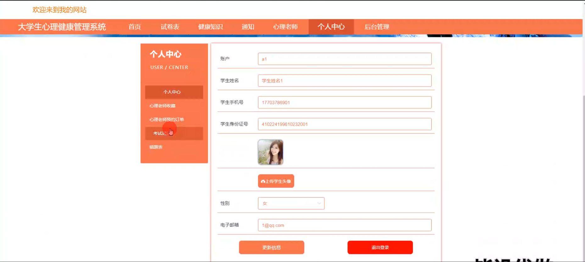

管理员端学生管理

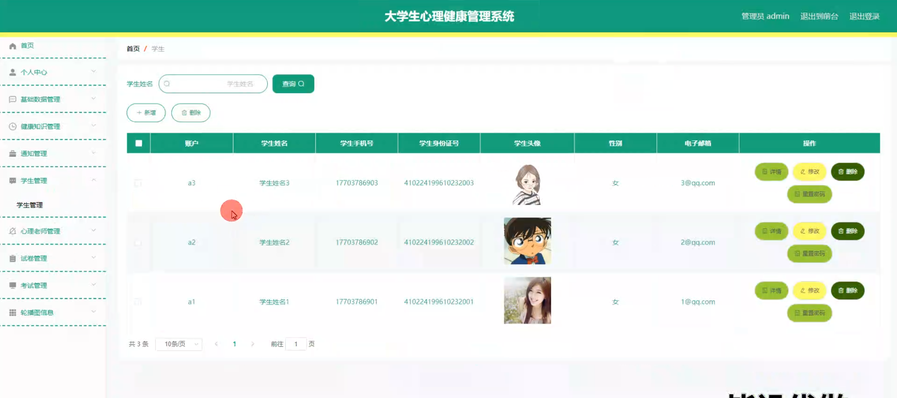

心理老师管理

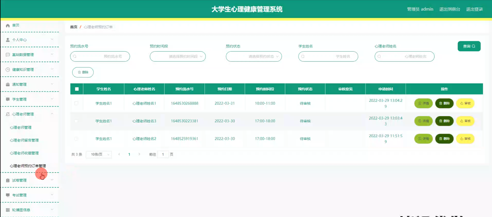

心理老师端心理老师管理

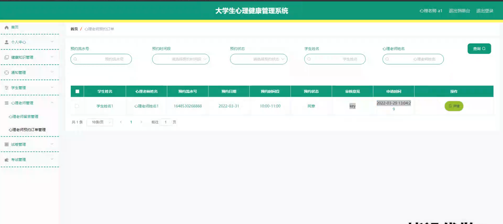

#### 总结

在当前大学生心理健康问题日益凸显的背景下，本大学生心理健康管理系统的开发具有重要的现实意义。它不仅填补了传统心理健康教育模式的空白，还通过数字化手段提升了心理健康教育的效率与质量。系统通过三大角色的协同工作，实现了心理健康知识的普及、学生心理状态的监测、以及心理健康教育的个性化服务，为构建健康、和谐的校园环境贡献了力量。未来，随着技术的不断进步和需求的日益多样化，本系统将持续优化升级，为大学生心理健康事业的发展提供更加坚实的支撑。

#### 使用说明

创建数据库，执行数据库脚本 修改jdbc数据库连接参数 下载安装maven依赖jar 启动idea中的springboot项目

前台登录页面
http://localhost:8080/xinlijiankangxitong/front/index.html

后台登录页面
http://localhost:8080/xinlijiankangxitong/admin/dist/index.html

管理员				账户:admin 		密码：admin

学生				账户:a3 		密码：123456

心理老师				账户:a1 		密码：123456